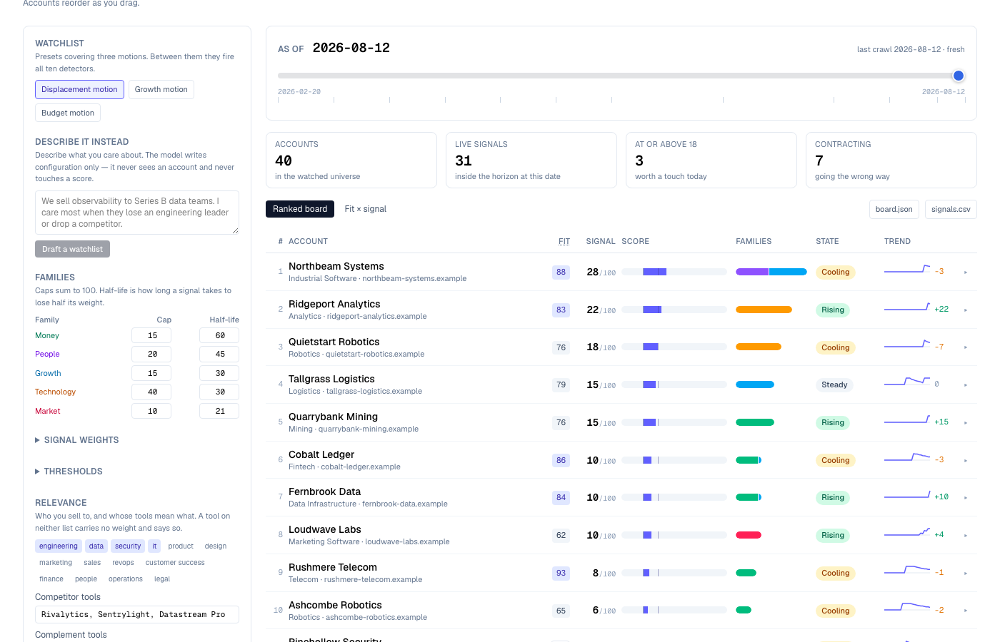
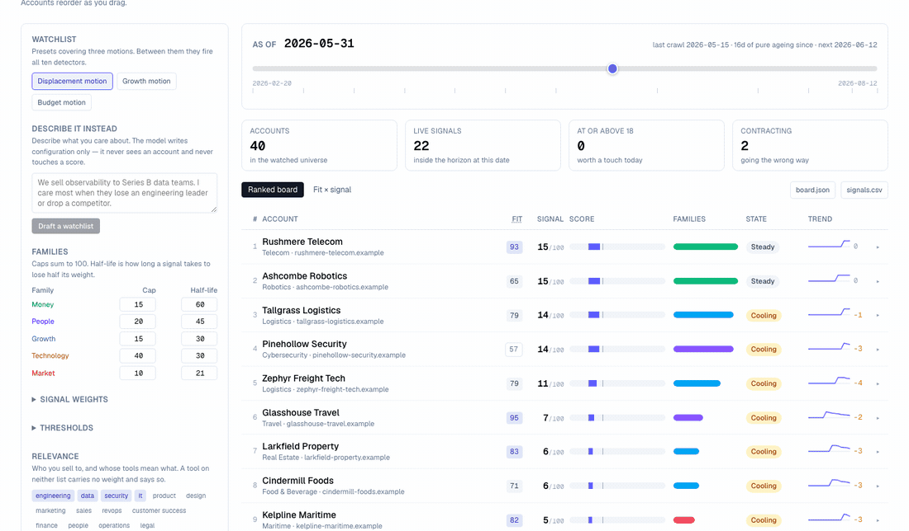
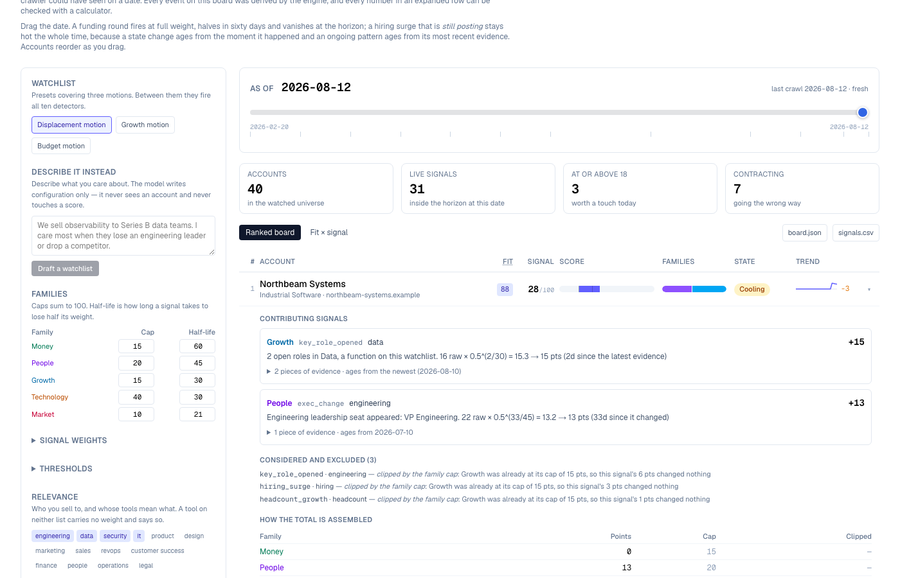
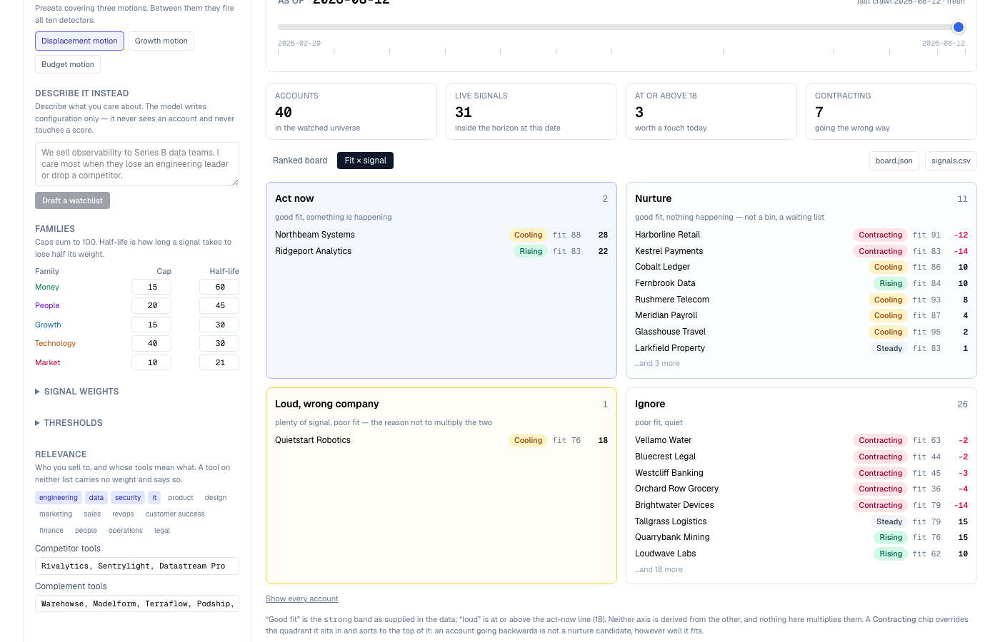

# SignalScout

Derives account events by comparing dated observations of the same company, ages
them, and ranks accounts by how timely outreach is right now.

[Live Demo](#) · [Demo GIF](#demo)

## Why I Built This

Every signal tool sells the same promise — *reach out when something changed* —
and almost all of them hand you a feed. A feed is a chronological list of things
that happened to companies, which is the wrong shape for the only question a rep
has at 9am: **who do I touch today, and why today rather than last month.**

Four failures follow from the feed shape.

**Nothing decays.** A round from February sits in the feed with the same weight
in October. But the reason a round is a signal is that budget just arrived and
gets spent over two quarters — the signal *is* the freshness, so a system that
stores events without ageing them has thrown away the payload.

**Noise compounds instead of saturating.** Six launches and a webinar outrank a
new CTO plus a funding round, because the score is a sum and launches are
numerous. Rank by that and the top of your board is whoever publishes most.

**Fit and timing get multiplied into one number.** A 60 meaning "perfect
customer, dead quiet" and a 60 meaning "on fire, company we can never sell to"
are indistinguishable, so the number stops being actionable.

**The events are given, not derived.** The feed arrives pre-labelled from a
vendor, so nobody demonstrates the part that is actually hard: taking two
observations of the same account and working out what changed, whether you have
seen it already, and how much you are allowed to claim about *when* it happened
when your crawler skipped ninety days.

## What It Does

40 synthetic accounts, each observed 12 times over six months. The input contains
**no events** — headcounts, funding stages, tool lists, exec rosters, page hashes,
and dated job posts and releases: the things a crawler could have seen on a date.

The engine compares adjacent observations, derives signals, ages them, and ranks:

1. Land on a ranked board — no upload, no key, no configuration.
2. Expand a row for every signal that fired, with raw weight, anchor date, age,
   half-life applied, and decayed points. Below it, everything **considered and
   excluded**, with the reason.
3. **Drag the as-of date.** A round fires at full weight, halves in sixty days,
   and vanishes at the horizon; a hiring surge that is still posting stays hot the
   whole time. Accounts reorder as you drag.
4. Tune the watchlist — half-lives, caps, weights, thresholds, functions you sell
   to, competitor and complement tools. The board recomputes instantly, locally.
5. Switch to **fit × signal** to see why the two are separate numbers.
6. Export `board.json` or `signals.csv`, or paste your own observations.
7. Optionally describe what you care about in prose and let Gemini draft the
   watchlist, which you then review and edit.

## Demo



Dragging the date — the whole argument in six seconds:



An expanded row: every number, and the arithmetic that produced it.



Fit and signal as two axes rather than one product:



## How It Works

```
observations (no labels)
   │
   ├── state deltas ────► headcount, funding, execs, stack, positioning
   │                      anchored at the PREVIOUS crawl (earliest it could have happened)
   └── dated items ─────► job posts, releases
                          anchored at the NEWEST evidence (an ongoing pattern is still fresh)
   │
   ▼
identity: account:type:subject — fold re-detections, re-fire on escalation
   │
   ▼
decay: raw × 0.5^(age / family half-life), dropped past 4 half-lives
   │
   ▼
score: diminishing returns within a family, caps that sum to 100, floor at −25
   │
   ▼
rank: total desc, fit as tiebreak — plus a lifecycle state derived from the trajectory
```

### The ten detectors

| Signal | Family | Shape | Fires on |
|---|---|---|---|
| `funding_round` | Money | state Δ | stage advances or total raised increases |
| `exec_change` | People | state Δ | roster seat gained or lost in a relevant function |
| `key_role_opened` | Growth | arrival | job post in a function you sell to |
| `hiring_surge` | Growth | arrival | N+ posts inside a trailing window |
| `headcount_growth` | Growth | state Δ | headcount up past a threshold |
| `headcount_contraction` | Growth | state Δ | headcount down — **counts against** |
| `stack_dropped` | Technology | state Δ | a competitor leaves the stack |
| `stack_added` | Technology | state Δ | complement enters (+) or competitor enters (−) |
| `positioning_change` | Market | state Δ | tagline, homepage or pricing page changes |
| `product_launch` | Market | arrival | a release appears |

## Architecture

```
                    ┌─ scrub / tune ─► lib/signals (imported directly, no network)
Browser ────────────┤
                    ├─ POST /api/board          → Zod → buildBoard → BoardRow[]
                    └─ POST /api/parse-watchlist → key check → rate limit
                                                → Gemini → Zod → config panel
```

`lib/signals/` imports **nothing non-relative** — not `next`, not `react`, not
`zod`, not `@/data`. A test scans the source for bare import specifiers, with no
allowlist. That constraint buys three things: the engine is unit-testable with no
harness, Day 007 `why-now` can import it unchanged, and it is cheap enough to ship
to the browser.

Layout: `lib/signals/` (types, `detect/{state,arrivals,identity}`, `decay`,
`score`, `rank`, `export`), `lib/watchlist/` (Zod schemas, Gemini parse, rate
limiter), `data/`, `app/api/`, `app/components/`.

## Key Decisions & Tradeoffs

**The decay anchor is asymmetric.**
Why: a state change happened once and only gets older; an arrival pattern still
producing evidence is still fresh. A round from June is old in August, but a
hiring surge that posted yesterday is not.
Tradeoff: two anchor rules to explain instead of one, and an arrival goes cold the
moment it stops clearing its threshold rather than tapering.

**A change is dated at the *earliest* moment it could have happened.**
Why: the one direction a timing tool must never err is claiming something is
fresher than the evidence supports. A 90-day gap means the change could be 90 days
old, so it is treated as 90 days old and labelled `known within 89 days`.
Tradeoff: every signal reads slightly older than it probably is, and the crawl
interval becomes a floor on apparent age — which is why the dataset crawls
fortnightly rather than monthly.

**Family caps that sum to 100, not normalisation.**
Why: the total is then natively 0–100 with **no division anywhere** in the scoring
path, which removes the whole `NaN`/divide-by-zero class rather than guarding
against it.
Tradeoff: editing a cap changes the denominator, so the board says `72 / 140`
instead of rescaling. Honest, but it surprises people once.

**Fit arrives as data and is never blended.**
Why: timing and fit answer different questions; one number cannot distinguish
"great company, quiet" from "on fire, wrong company".
Tradeoff: two numbers to read instead of one, and no single sort that satisfies
everybody.

**Diminishing returns on positives, full weight on negatives.**
Why: a second launch is worth less than the first; a second round of layoffs is
not less bad than the first.
Tradeoff: asymmetric maths that has to be explained in the UI.

**The engine runs in the browser as well as behind the API.**
Why: the date scrubber recomputes on every frame, and a request per frame is a
stutter per frame.
Tradeoff: the engine ships in the client bundle, and two call paths must agree —
guarded by `equivalence.test.ts`, which asserts that filtering pre-computed
detections equals re-deriving them from a truncated history, at every crawl date.

**Gemini tunes the ruler and never reads the measurement.**
Why: every number on the board must be checkable arithmetic over visible data.
Tradeoff: the genuinely useful LLM job here — classifying a raw news item — is
deferred, because it would put a model inside the detection path.

## Getting Started

### Prerequisites

Node 20+ and npm.

### Installation

```bash
git clone https://github.com/akshatiwarix/signal-scout.git
cd signal-scout
npm install
```

### Configuration

Optional. Copy `.env.example` to `.env.local` and add a Gemini key to enable the
prose-to-watchlist box:

```bash
GEMINI_API_KEY=your-key-here
```

**The app is fully functional without it.** The board, the scrubber, the watchlist
editor, the exports and the API need no key and no network.

### Run Locally

```bash
npm run dev        # http://localhost:3000
```

## Usage

The board is the product; the API is there if you want it.

```bash
curl -s -X POST http://localhost:3000/api/board \
  -H 'content-type: application/json' \
  -d '{
    "accounts": [ ... ],
    "observations": [ ... ],
    "watchlist": { ... },
    "as_of": "2026-08-12"
  }'
```

Returns `{ as_of, watchlist_name, denominator, act_now_at, rows, summary }`, where
each row carries its signals with full evidence, its dropped signals with reasons,
its family breakdown, its lifecycle state and its weekly trajectory.

Bodies are capped at 1 MB (413), at 500 accounts and 5,000 observations, and Zod
failures come back as `{ error, issues: [{ path, message }] }` so a rejected paste
names the offending field.

```bash
npm run generate:dataset   # regenerate the synthetic dataset from its recipe
npm run sweep              # invariant sweep across every as-of date × every preset
```

## Validation / Testing

```bash
npm test           # 127 tests over the engine, dataset, schemas and exports
npm run sweep      # ~137,000 assertions across the reachable state space
npm run typecheck
npm run lint
npm run build
```

Two tests carry more weight than the rest. `purity.test.ts` enforces the import
boundary. `dataset.test.ts` pins ten engineered rows — including one that asserts
on the raw bytes that the input contains no event labels, so the central claim
cannot quietly stop being true.

`npm run sweep` walks every as-of date × all three presets × 40 accounts and
asserts: no `NaN` anywhere, totals within `[−25, denominator]`, families within
their caps, ranking deterministic and correctly ordered, no duplicate signal keys,
the first observation of every account silent, sparklines agreeing with the board,
and **a signal's absolute contribution never growing without new evidence**.

That last property was worth the effort twice over. Its first version compared
signal *counts* and reported nine violations — all of them one signal expiring in
the same step as another arriving, with the count unchanged. Comparing key
identity instead made the property mean what it said. It was then fault-injected
to confirm it has teeth: inverting the decay exponent produces 1,619 violations.

## Limitations

- **The data is synthetic.** 40 accounts, generated from a committed recipe. Every
  domain uses the reserved `.example` TLD and every tool name is invented, so no
  row can be mistaken for a real company or a real vendor relationship.
- **No live sources.** No RSS, no job boards, no news APIs. Live single-source
  monitoring is later in the challenge; this repo is about what to do with
  observations once you have them.
- **No persistence and no cron.** The engine is a pure function of
  `(observations, watchlist, as_of)`. Time is simulated by the scrubber.
- **Rate limiting is in-memory and per-instance.** On Vercel the real limit is
  5/minute × instances. Fixing it properly means Redis.
- **Titles are matched with a keyword table**, so an unusual title lands as
  `unplaced` and says so rather than being guessed at. Real normalisation is a
  later day.
- **Scores top out around a third of the denominator.** Reaching 100 would need
  every family firing at once, which nothing real does.
- **The crawl interval bounds apparent freshness.** Conservative dating means a
  change can never look newer than the previous crawl, so sparse crawling makes
  everything look older. That is a true statement about sparse crawling, and it is
  why the dataset crawls fortnightly.
- **No auth, no multi-tenancy, no E2E tests, no CI.**

## What I'd Build Next

- **LLM classification of raw items** inside detection — the honest next step,
  gated by an eval suite, because it would put a model in the scoring path.
- **Live adapters** behind the same `Observation` interface, so the engine does not
  change at all.
- **Persisted observation history** with real cron polling, replacing the
  simulated clock.
- **Digest delivery** when an account crosses the act-now line.
- **Cross-account correlation** — one competitor losing three customers in a month
  is a stronger signal than any of the three alone.

## License

MIT — see [LICENSE](LICENSE).

---

Day 005 of a 100-day build challenge. Previous days: Day 001
[`icp-score`](https://github.com/akshatiwarix/icp-score) (whose fit scores arrive
here as data), Day 002
[`enrichment-waterfall`](https://github.com/akshatiwarix/enrichment-waterfall),
Day 003 [`lead-cleaner`](https://github.com/akshatiwarix/lead-cleaner), Day 004
[`persona-mapper`](https://github.com/akshatiwarix/persona-mapper).
